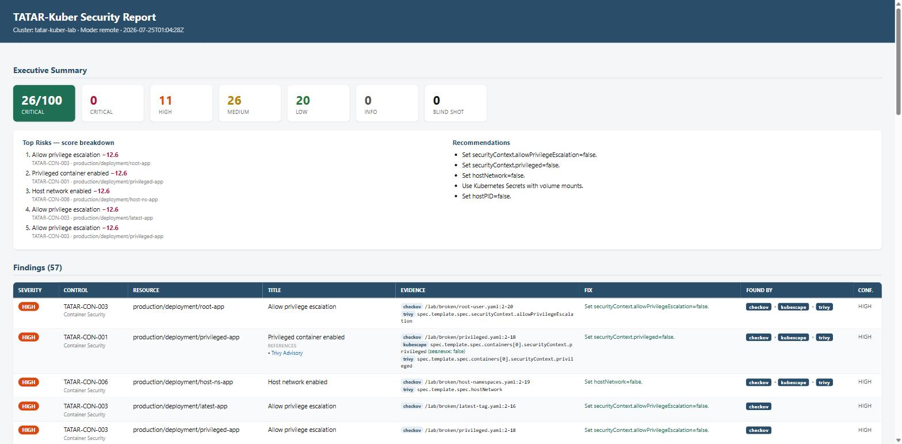

# TATAR-Kuber

**Kubernetes security posture assessment framework.**
Нэг команд, олон scanner, нэг стандарт тайлан.

> Агент суулгалгүйгээр (Mode B) эсвэл локал manifest дээр (Mode A) Kubernetes
> орчны аюулгүй байдлыг шалгаж, **Trivy · Kubescape · Checkov · Popeye**-ийн
> үр дүнг нэг canonical стандарт руу нэгтгэн, инженер / auditor / CISO ойлгох
> нэг тайлан гаргана.

**Author:** Enkhbat.O — Security analyst

```bash
tatar-kuber scan --kubeconfig ~/.kube/config
tatar-kuber report -o html --open
```

## Report — one issue, every scanner, both languages

The same finding rendered in **English** and **Mongolian** (`--lang en|mn`). Note
`found_by = checkov · kubescape · trivy` on the privileged container → the unified,
de-duplicated view with confidence, evidence and remediation.

| English | Монгол |
|---|---|
|  |  |

## Design Principles

- **Read-Only First** — customer орчинг хэзээ ч өөрчлөхгүй (get/list/watch).
- **Scanner Agnostic** — TATAR-Kuber өөрөө scanner биш; Orchestrator +
  Normalizer + Risk Engine + Reporting Engine.

## Scanner Stack (v1.0)

| Scanner | Зорилго |
|---|---|
| Trivy | Image CVE, secret, misconfiguration |
| Kubescape | NSA / MITRE / RBAC / compliance (primary posture engine) |
| Checkov | IaC (YAML / Helm / Terraform) |
| Popeye | Runtime hygiene (dead service, unused, broken ref) |

> `kube-bench` (node/CIS) нь privileged DaemonSet шаарддаг тул MVP-д
> багтаагүй — Enterprise Agent (Mode C, v2).

## Features (v1.0)

- Local (Mode A) + Remote (Mode B) scan
- **Canonical Control Mapping** — scanner rule ID-г нэг хэл рүү
- **Deduplication** — давхардлыг арилгах (canonical + resource + namespace)
- **Severity normalization** + **Risk Scoring v1.2** (Level 1 finding + Level 2 cluster 0–100)
- **Blind Shot** — контекстээр downgrade (устгахгүй, ил үлдэнэ)
- Output: **JSON** · **SARIF** (GitHub/GitLab/Azure) · **HTML dashboard**

## Гол хөрөнгө (product asset)

`schema/canonical-controls.yaml` — TATAR Canonical Control Registry.
Scanner солигдоно; canonical registry + risk model + normalization engine
бол бүтээгдэхүүний оюун ухаан.

## Project Layout

```
cmd/tatar-kuber/       CLI entrypoint
internal/
  cli/                 команд dispatch
  scanner/             ScannerAdapter + trivy|kubescape|checkov|popeye
  canonical/           canonical-controls.yaml loader + resolve
  finding/             Unified Finding Schema
  risk/                Risk Scoring Model v1.2 (+ test)
  report/              json | sarif | html
  kube/                read-only client-go wrapper (Mode B)
schema/                canonical-controls.yaml, tatar-schema-v1.json
deploy/                least-privilege-clusterrole.yaml
docs/                  01–06 engineering documents
```

## Build

```bash
go build ./...
go test ./...
./scripts/build.sh 1.0.0     # cross-platform dist/
```

## Mode B RBAC

Remote scan-д зориулсан least-privilege ClusterRole:
`deploy/least-privilege-clusterrole.yaml` (зөвхөн get/list/watch).

## Status

`v1.0` — architecture LOCKED, skeleton scaffolding. Adapter/engine
хэрэгжүүлэлт хийгдэж байна.

## License

Open Core. Community CLI — Apache-2.0.

## Quick demo (offline ingest)

Scanner binary шаардлагагүй — цуглуулсан raw JSON-оос:

```bash
go run ./cmd/tatar-kuber scan --raw-dir examples/raw --cluster production \
    --registry schema/canonical-controls.yaml -o examples/out
go run ./cmd/tatar-kuber report --input examples/out/scan-result.json -o html --out report.html
go run ./cmd/tatar-kuber report --input examples/out/scan-result.json -o sarif --out out.sarif
```

`examples/raw/` дотор 4 scanner-ийн жишээ гаралт бий. Pipeline тэдгээрийг
canonical control руу normalize хийж, дедуп хийж (ж: privileged container-ыг
Trivy+Kubescape+Checkov гурвуулаа олоод нэг finding, `confidence=HIGH`),
risk оноо тооцож, JSON/SARIF/HTML тайлан гаргана.

## Status (v0.2.0-mvp)

Бүрэн ажиллагаатай engine + тайлан, бүх модуль тесттэй:

- ✅ Canonical registry (33 control) + validation
- ✅ 4 scanner adapter: Trivy, Kubescape, Checkov, Popeye (Normalize + fixtures)
- ✅ Dedup engine (cross-scanner merge, found_by, confidence)
- ✅ Blind-shot engine (downgrade + annotate)
- ✅ Risk scoring v1.2 (Level 1 finding + Level 2 cluster 0–100)
- ✅ Orchestrator pipeline + detrministik result_hash
- ✅ Reports: JSON · SARIF 2.1.0 · HTML dashboard
- ✅ CLI: scan (offline ingest ажиллана) · report · version
- ⏳ Live scan (scanner binary дуудлага), update (cosign verify), remote client-go — дараагийн үе

## Test lab

Vulnerable/hardened manifests + regression harness live in a separate repo:
**[tatar-kuber-lab](https://github.com/ochmunkh/tatar-kuber-lab)**.

```bash
tatar-kuber scan --raw-dir <lab>/raw -o out
tatar-kuber verify-lab --input out/scan-result.json --expected <lab>/expected-findings.json
```
